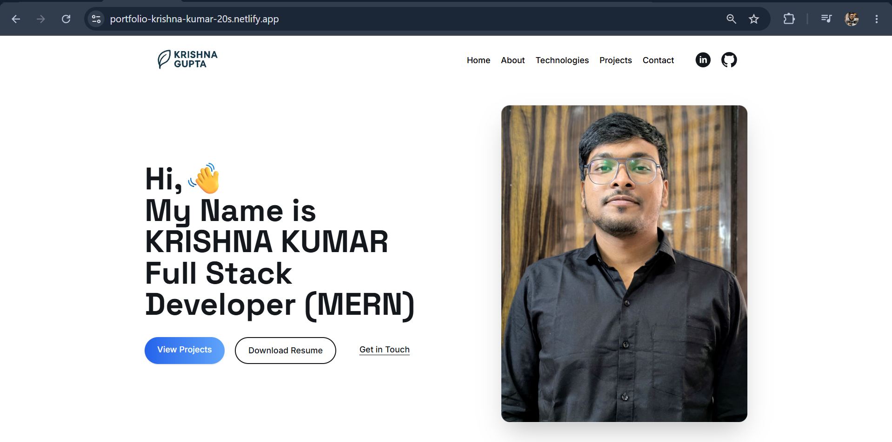

# 👋 Krishna Kumar - Developer Portfolio

A modern, responsive developer portfolio built with **React.js**, **Tailwind CSS**, and **GSAP** to showcase my projects, technical skills, and professional profile.

🌐 **Live Demo:** https://portfolio-krishna-kumar-20s.netlify.app

---

## 📸 Preview



---

## ✨ Features

- 🎨 Modern and responsive UI
- ⚡ Built with React.js
- 💨 Styled using Tailwind CSS
- 🎬 Smooth animations using GSAP
- 📱 Mobile-friendly design
- 📂 Dedicated Projects section
- 🛠️ Technologies showcase
- 📄 Resume download
- 📬 Contact section with social links
- 🚀 Optimized for deployment on Netlify

---

## 🛠️ Tech Stack

### Frontend
- React.js
- Tailwind CSS
- JavaScript (ES6+)
- HTML5
- CSS3

### Animation
- GSAP

### Routing
- React Router DOM

### Deployment
- Netlify

---

## 📂 Project Structure

```
src/
│
├── Components/
│   ├── Header.js
│   ├── Footer.js
│   ├── Project.js
│   └── Work.js
│
├── Pages/
│   ├── Home.js
│   ├── About.js
│   ├── Technologies.js
│   ├── Projects.js
│   └── Contact.js
│
├── assets/
├── Details.js
├── App.js
└── index.js
```

---

## 🚀 Getting Started

### Clone the repository

```bash
git clone https://github.com/krish8986/react-developer-portfolio.git
```

Move into the project

```bash
cd react-developer-portfolio
```

Install dependencies

```bash
npm install
```

Start the development server

```bash
npm start
```

Create a production build

```bash
npm run build
```

---

## 📌 Featured Projects

### 🌿 Aranya - Eco-Friendly Notebook E-commerce Platform

A production-ready MERN stack application featuring:

- JWT Authentication
- Refresh Token Authentication
- Redis Caching
- Socket.IO Real-time Order Updates
- Cloudinary Image Uploads
- Product Reviews & Ratings
- Admin Dashboard
- Email Notifications
- Docker Support
- REST APIs

---

### 🤖 AI Predictive Credit Underwriting

Machine Learning project focused on predicting customer creditworthiness using historical financial data.

---

## 📬 Contact

**Krishna Kumar**

📧 Email: your-email@example.com

💼 LinkedIn: https://www.linkedin.com/in/krishna-kumar-deve/

💻 GitHub: https://github.com/krish8986

---

## ⭐ If you like this project

Please consider giving it a **Star ⭐** on GitHub.

---

Made with ❤️ by Krishna Kumar